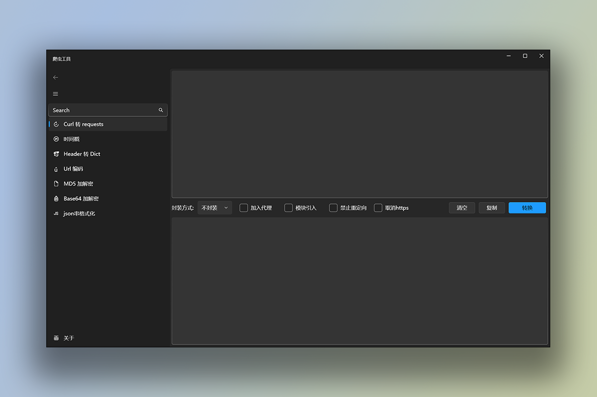
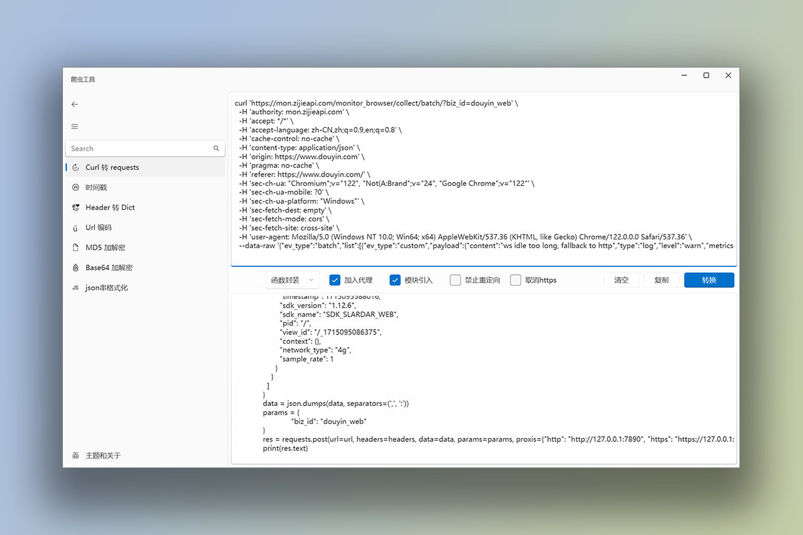
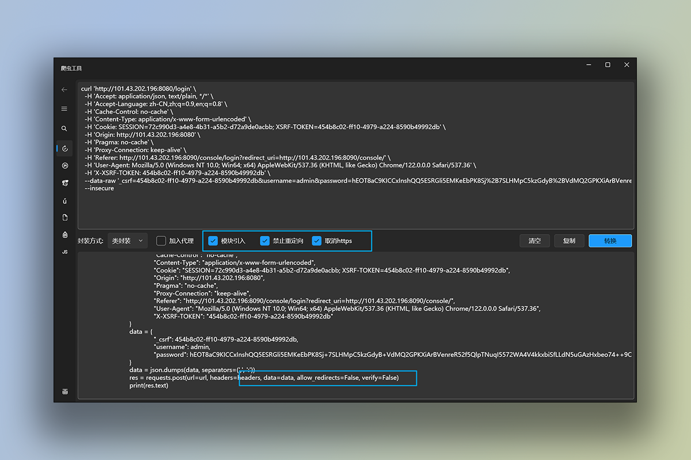
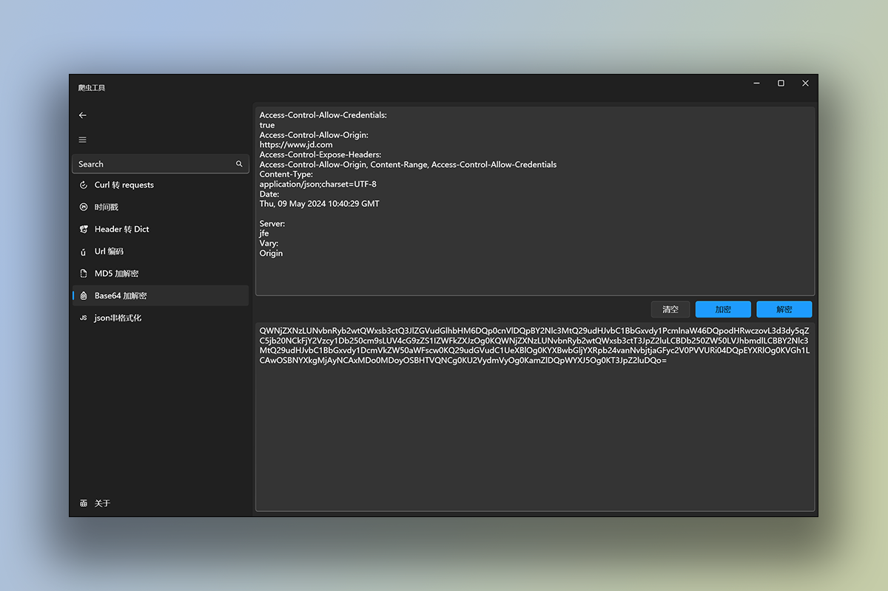

### 关于此工具

这个工具是我在学习WPF的旅程中迈出的一小步。虽然我还在不断学习和探索的过程中，但我相信开放源代码和社区的力量能够帮助我们共同成长。我期待着您的反馈和建议，让我们携手前进。

开发的契机，之前一直从事爬虫方向的工作对于一些网站的工具使用较为频繁，因为不可抗力的因素离职在家歇业，所以想学习.NET中的WPF技术，学习一门新的框架就是使用，So~

#### 感谢

<a href="https://github.com/lov729">    </a>

在学习过程中,对我的帮助和解疑

#### 灵感来源

https://www.spidertools.cn/ 爬虫工具站

https://tool.lu/timestamp/ 时间戳工具

#### 界面

[Curl 测试代码](./CurlTest.md)

在这里，我也想分享一些个人经历。作为一名残疾人，我目前没有固定的工作。对我而言，编程是一种表达自己、与世界连接的方式。我希望这个小工具不仅能为他人带来便利，也能够为我自己开启一扇门。

所以有类似软件开发需求的话可以尝试联系我哦！

dewujie64@gmail.com

